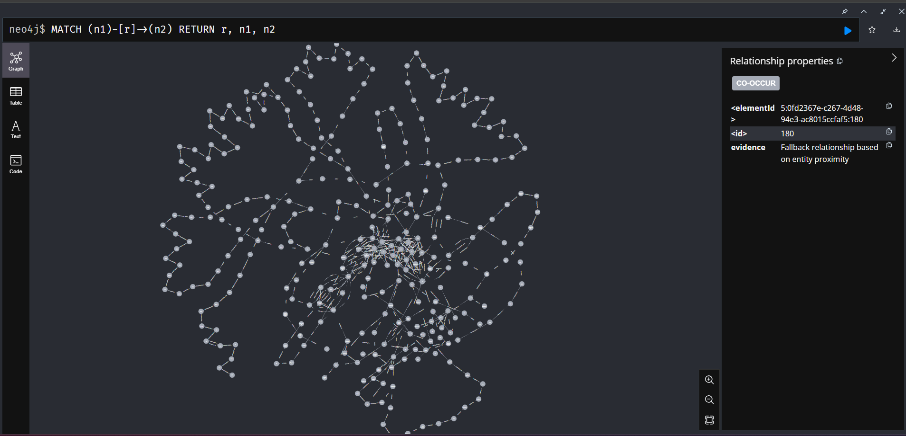
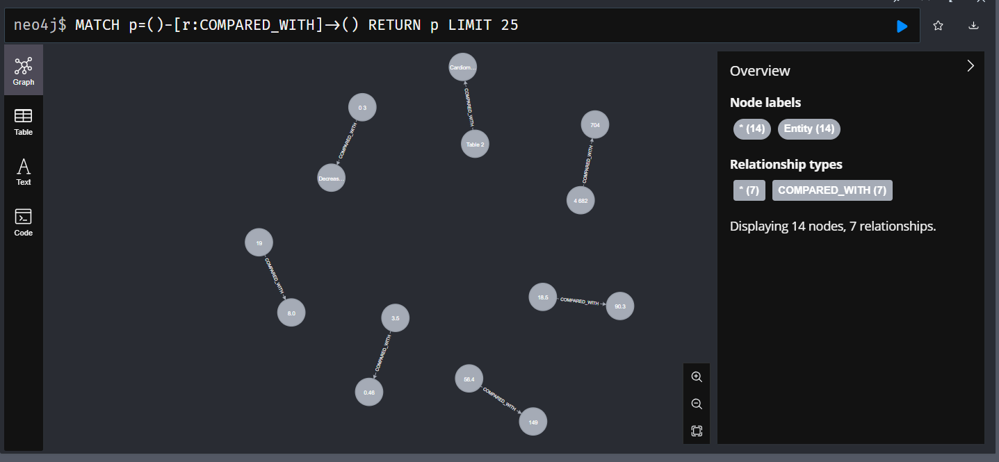

## Medical NER + Knowledge Graph by LLM

Jupyter notebook: **Medical_NER_KG.ipynb**

## Environment Setup
```
bash
pip install -r requirements.txt
```

## Docker Setup And Neo4J setup

To launch Neo4j locally, first ensure you have docker installed. Then, you can launch the database with the following docker command.

```
docker run \
    -p 7474:7474 -p 7687:7687 \
    -v $PWD/data:/data -v $PWD/plugins:/plugins \
    --name neo4j-apoc \
    -e NEO4J_apoc_export_file_enabled=true \
    -e NEO4J_apoc_import_file_enabled=true \
    -e NEO4J_apoc_import_file_use__neo4j__config=true \
    -e NEO4JLABS_PLUGINS=\[\"apoc\"\] \
    neo4j:latest
```
From here, you can open the db at http://localhost:7474/. On this page, you will be asked to sign in. Use the default username/password of neo4j and neo4j.

Once you login for the first time, you will be asked to change the password.

## Relationship


